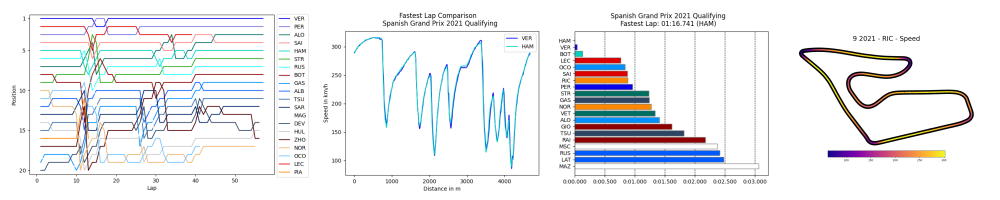

# FastF1

FastF1 is a python package for accessing and analyzing Formula 1 results,
schedules, timing data and telemetry.




## Main Features

- Access to F1 timing data, telemetry, sessions results and more
- Full support for [Ergast](http://ergast.com/mrd/) to access current and
  historical F1 data
- All data is provided in the form of extended Pandas DataFrames to make
  working with the data easy while having powerful tools available
- Adds custom functions to the Pandas objects specifically to make working
  with F1 data quick and simple
- Integration with Matplotlib to facilitate data visualization
- Implements caching for all API requests to speed up your scripts


## Installation

It is recommended to install FastF1 using `pip`:

```commandline
pip install fastf1
```

Note that Python 3.8 or higher is required.

Alternatively, a wheel or a source distribution can be downloaded from Pypi.

You can also install using `conda`:

```commandline
conda install -c conda-forge fastf1
```

## Documentation

The official documentation can be found here:
[docs.fastf1.dev](https://docs.fastf1.dev)


## Supporting the Project

If you want to support the continuous development of FastF1, you can buy me
a coffee.

<a href="https://www.buymeacoffee.com/fastf1" target="_blank"></a>


## Notice

FastF1 and this website are unofficial and are not associated in any way with
the Formula 1 companies. F1, FORMULA ONE, FORMULA 1, FIA FORMULA ONE WORLD
CHAMPIONSHIP, GRAND PRIX and related marks are trade marks of Formula One
Licensing B.V.
