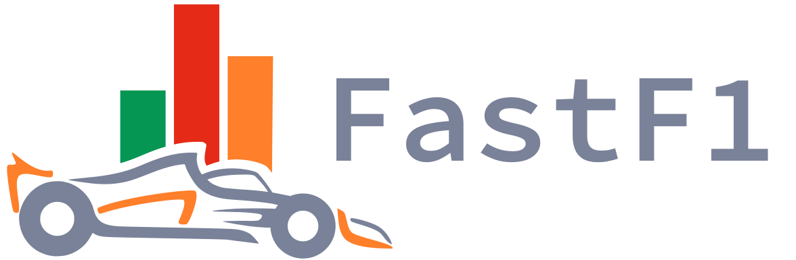

<h1 align="center">

</h1><br>
A python package for accessing and analyzing Formula 1 results,
schedules, timing data and telemetry.

## Main Features

- Access to F1 timing data, telemetry, sessions results and more
- Full support for the Ergast compatible [jolpica-f1](https://github.com/jolpica/jolpica-f1/blob/main/docs/README.md) API to access current and
  historical F1 data
- All data is provided in the form of extended Pandas DataFrames to make
  working with the data easy while having powerful tools available
- Adds custom functions to the Pandas objects specifically to make working
  with F1 data quick and simple
- Integration with Matplotlib to facilitate data visualization
- Implements caching for all API requests to speed up your scripts


## Installation

It is recommended to install FastF1 using `pip`:

```commandline
pip install fastf1
```

Alternatively, a wheel or a source distribution can be downloaded from Pypi.

You can also install using `conda`:

```commandline
conda install -c conda-forge fastf1
```

#### Installation in Pyodide, JupyterLite and other WASM-based environments

FastF1 should be mostly compatible with Pyodide and other WASM-based 
environments, although this is not extensively tested. Currently, the 
installation and usage require some additional steps. You can find more 
information and a guide in
[this external repository](https://github.com/f1datajunkie/jupyterlite-fastf1)
and the discussion in [this issue](https://github.com/theOehrly/Fast-F1/issues/667).

### Third-party packages

- R package that wraps FastF1: https://cran.r-project.org/package=f1dataR

Third-party packages are not directly related to the FastF1 project. Questions 
and suggestions regarding these packages need to be directed at their 
respective maintainers.

## Documentation

The official documentation can be found here:
[docs.fastf1.dev](https://docs.fastf1.dev)


## Supporting the Project

If you want to support the continuous development of FastF1, you can sponsor me
on GitHub or buy me a coffee.

https://github.com/sponsors/theOehrly

<a href="https://www.buymeacoffee.com/fastf1" target="_blank"></a>


## Notice

FastF1 and this website are unofficial and are not associated in any way with
the Formula 1 companies. F1, FORMULA ONE, FORMULA 1, FIA FORMULA ONE WORLD
CHAMPIONSHIP, GRAND PRIX and related marks are trade marks of Formula One
Licensing B.V.
