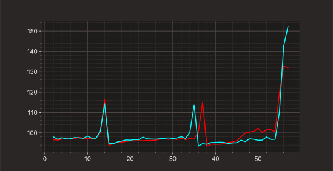

=======
Fast F1
=======

FastF1 is a python package for accessing and analyzing Formula 1 results,
schedules, timing data and telemetry.

Installation
============

It is recommended to install FastF1 using pip:

    pip install fastf1

Note that Python 3.8 or higher is required.
(The live timing client does not support Python 3.10, therefore full
functionality is only available with Python 3.8 and 3.9)

Alternatively, a wheel or a source distribution can be downloaded from Pypi.

Getting Started: Documentation and Examples
===========================================

 - `Documentation <https://theoehrly.github.io/Fast-F1/>`_.
 - `Examples <https://theoehrly.github.io/Fast-F1/examples/index.html>`_.
 - `Changelog <https://theoehrly.github.io/Fast-F1/changelog.html>`_.
 - `Contributing <https://theoehrly.github.io/Fast-F1/contributing/index.html>`_.

Furthermore, there are  some great articles and examples written by other
people. They provide a nice overview about what you can do with FastF1 and
might help you to get started.

  - `Accessing Formula-1 Race's historical data using Python (medium.com) <https://pandeyparul.medium.com/accessing-formula-1-races-historical-data-using-python-b7c80e544f50>`_
  - `Formula 1 Data Analysis Tutorial - 2021 Russian GP: "To Box, or Not to Box?" (medium.com) <https://medium.com/@jaspervhat/formula-1-data-analysis-tutorial-2021-russian-gp-to-box-or-not-to-box-da6399bd4a39>`_
  - `How to Analyze Formula 1 Telemetry in 2022 - A Python Tutorial (medium.com) <https://medium.com/towards-formula-1-analysis/how-to-analyze-formula-1-telemetry-in-2022-a-python-tutorial-309ced4b8992>`_

General Information
===================

Usage
-----

Creating a simple analysis is not very difficult, especially if you are already familiar
with pandas and numpy.

Suppose that we want to analyse the race pace of Leclerc compared to
Hamilton for the Turkish GP 2020.

.. code:: python

    import fastf1
    from fastf1 import plotting
    from matplotlib import pyplot as plt

    plotting.setup_mpl()

    fastf1.Cache.enable_cache('path/to/folder/for/cache')  # optional but recommended

    race = fastf1.get_session(2020, 'Turkish Grand Prix', 'R')
    race.load()

    lec = race.laps.pick_driver('LEC')
    ham = race.laps.pick_driver('HAM')

Once the session is loaded, and drivers are selected, you can plot the
information.

:code:`fastf1.plotting` provides some special axis formatting and data type conversion. This is required
for generating a correct plot.

It is not necessary to enable the usage of a cache but it is recommended. Simply provide
the path to some empty folder on your system.

.. code:: python

    fig, ax = plt.subplots()
    ax.plot(lec['LapNumber'], lec['LapTime'], color='red')
    ax.plot(ham['LapNumber'], ham['LapTime'], color='cyan')
    ax.set_title("LEC vs HAM")
    ax.set_xlabel("Lap Number")
    ax.set_ylabel("Lap Time")
    plt.show()

Compatibility
-------------

Timing data, car telemetry and position data is available for the 2018 and
later seasons. Schedule information and session results are available for
older seasons too.
(limited to `Ergast web api <http://ergast.com/mrd/>`_).

Data Sources
------------

FastF1 uses data from F1's live timing service.

Data can be downloaded after a session. Alternatively, the actual live timing
data can be recorded and the recording can be used as a data source.

Usually it is not necessary to record the live timing data. But there have
been server issues in the past which resulted in the data being unavailable
for download. Therefore, you only need to record live timing data if you
want to benefit from the extra redundancy.

Notice
------

FastF1 is unofficial software and in no way associated with the Formula 1
group of companies.
